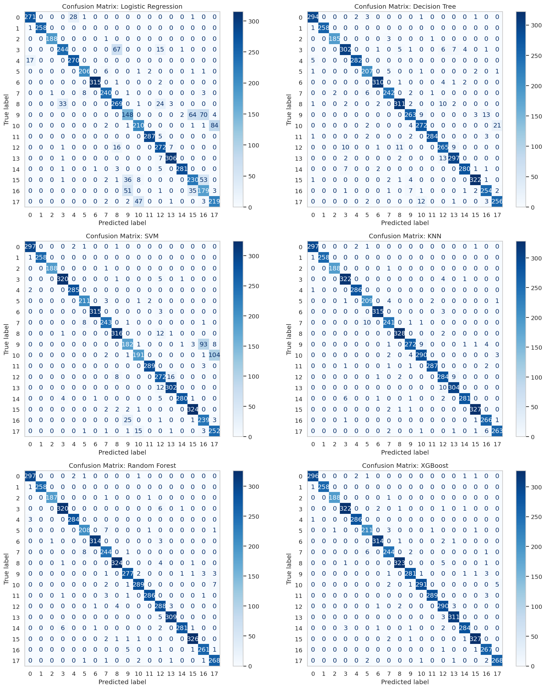
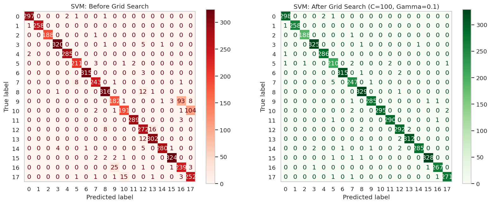
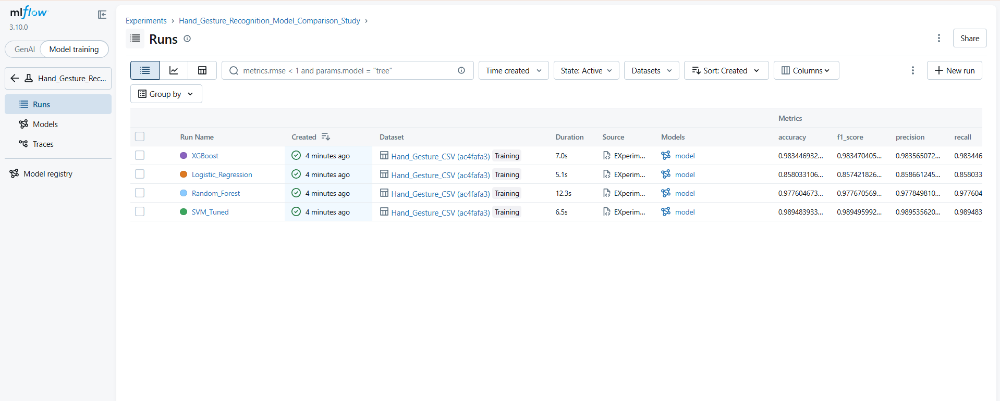
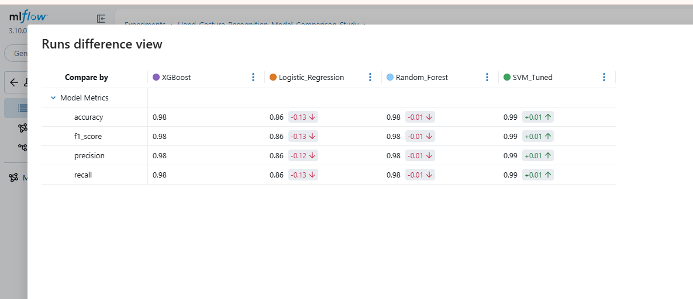

<!-- # 🖐 Hand Gesture Classification using MediaPipe Landmarks (HaGRID)

## Project Overview

This project aims to build a machine learning system capable of classifying hand gestures using landmark coordinates extracted from the **HaGRID (Hand Gesture Recognition Image Dataset)** via MediaPipe.

The input data consists of 3D hand landmark coordinates (x, y, z) representing 21 keypoints per detected hand.  
The output is a trained classification model that predicts the corresponding gesture class.
This project follows a structured ML workflow including data preprocessing, model training, evaluation and experiment tracking using MLflow.

---

## Dataset Description

- Dataset: HaGRID (Hand Gesture Recognition Image Dataset)
- 21 hand landmarks per sample
- Each landmark contains:
  - x coordinate
  - y coordinate
  - z coordinate
- Total numerical features: **63**
- Number of gesture classes: **18**

### Preprocessing Strategy

To ensure scale and position invariance:

- Recenter all (x, y) coordinates so the wrist landmark becomes the origin.
- Normalize (x, y) coordinates by dividing by the middle finger tip position.
- The z-coordinate is left unchanged as it is already normalized by MediaPipe.

---

##  Project Structure

```
Hand-Gesture-Recognition-HaGRID-Dataset/

Hand-Gesture-Recognition-HaGRID-Dataset/
├── Data/                   # Dataset files
├── Notebooks/              # Source code: Visualization, Preprocessing, Models, Evaluation
├── MLflow Screenshots/     # MLflow UI screenshots (research experiments)
├── mlruns/                 # MLflow experiment tracking (research branch)
├── MLflow Notebooks/       # Notebooks related to MLflow experiments
├── README.md               # This file
└── Requirements.txt        # Project dependencies

```

## 🤖 Machine Learning Models

At least three classification models will be implemented and compared including:

- Random Forest
- Support Vector Machine (SVM)
- Logistic Regression
- (Optional) Gradient Boosting / XGBoost

Hyperparameter tuning and performance comparison will be conducted using MLflow experiment tracking.

---

## 📊 Evaluation Metrics

Model performance will be evaluated using:

- Accuracy
- Precision
- Recall
- F1-Score
- Confusion Matrix

The best-performing model will be selected based on overall generalization performance.

---

## Experiment Tracking

All experiments, parameters, metrics and models will be tracked using MLflow (research branch only).

The final selected model will be registered in the MLflow Model Registry.

---

## Deployment Demonstration

A demonstration video will show:

- Real-time hand landmark extraction using MediaPipe
- Gesture prediction per frame
- Stabilized output using a sliding window mode technique

---

##  Repository Branch Strategy

- `main` branch → Clean ML1 project deliverables (no MLflow code)
- `research` branch → Full MLflow integration and experiment tracking

---

## Status

Project initialization phase — development in progress -->


# 🖐 Hand Gesture Classification using MediaPipe Landmarks (HaGRID)

## Overview

This project implements a complete **end‑to‑end machine learning pipeline** for static hand gesture recognition using 3D landmark coordinates extracted with MediaPipe from the **HaGRID (Hand Gesture Recognition Image Dataset)**

The system learns discriminative geometric patterns of hand poses and outputs a trained classifier capable of **real‑time gesture prediction** from webcam streams


The project follows a reproducible ML lifecycle:

1. Data acquisition & inspection
2. Landmark visualization
3. Geometric normalization
4. Feature preparation
5. Model training & tuning
6. Evaluation & error analysis
7. Experiment tracking (MLflow)
8. Real‑time inference demo

---

##  Objectives

* Build a robust gesture classifier invariant to hand position & scale
* Compare multiple classical ML algorithms on landmark geometry
* Analyze per‑gesture performance and confusion patterns
* Demonstrate real‑time prediction using MediaPipe landmarks
* Ensure reproducibility via MLflow tracking

---

## 🧠 Problem Formulation

Each detected hand is represented by **21 anatomical landmarks** with 3D coordinates:

* x → horizontal location
* y → vertical location
* z → relative depth (MediaPipe normalized)

Feature vector size:

```
21 landmarks × 3 coordinates = 63 features
```

Target:

```
Gesture label ∈ {18 classes}
```


---

## 📂 Dataset — HaGRID

HaGRID is a large‑scale hand gesture dataset containing diverse hand poses captured in real‑world conditions

Dataset characteristics:

* 18 gesture categories
* Pose orientation variation
* Scale variation
* Background diversity
* Different lighting conditions
* Multiple subjects

Landmarks are extracted using **MediaPipe Hands** producing consistent anatomical keypoints


---

## 🔎 Landmark Representation

MediaPipe provides 21 standardized hand keypoints:

* Wrist
* Thumb (4 joints)
* Index (4 joints)
* Middle (4 joints)
* Ring (4 joints)
* Pinky (4 joints)

This representation encodes full hand articulation and finger configuration, enabling gesture discrimination purely from geometry


---

## ⚙️ Preprocessing & Normalization Pipeline

Raw landmarks depend on camera position and hand scale. To achieve invariance geometric normalization is applied.

### 1️⃣ Translation Normalization (Re‑centering)

Wrist landmark becomes origin:

```
x' = x − x_wrist
y' = y − y_wrist
```

Effect:

* Removes global hand position
* Aligns all hands to same reference point

---

### 2️⃣ Scale Normalization

Coordinates divided by distance to middle‑finger tip:

```
d = √((x_mid − x_wrist)² + (y_mid − y_wrist)²)
x'' = x' / d
y'' = y' / d
```

Effect:

* Removes hand size variation
* Normalizes across users & camera distance

---

### 3️⃣ Depth Handling

MediaPipe z is already normalized → kept unchanged.

Result:

**Pose‑dependent but position & scale invariant landmark geometry**


---

## 📊 Exploratory Data Analysis (EDA)

The notebook includes extensive visualization to understand dataset structure:

### Analyses Performed

* Class distribution histogram
* Gesture imbalance analysis
* Landmark coordinate scatter plots
* Normalized hand skeleton visualization
* Sample geometry per class

### Key Findings

* Dataset shows class imbalance across gestures
* Normalization aligns hand geometry across samples
* Distinct spatial patterns exist per gesture
* Landmark clusters become separable post‑normalization

---

## 🧾 Feature Preparation

After normalization:

* Features flattened into 63‑D vector
* Optional scaling (StandardScaler)
* Train/validation split
* Stratified sampling to preserve class distribution

Feature characteristics:

* Continuous numeric
* Low dimensional (63)
* Highly correlated within fingers
* Nonlinear inter‑finger relationships

---

## 🤖 Machine Learning Models

Multiple classical classifiers were trained and compared.

### Logistic Regression

* Linear decision boundary
* Baseline geometric separability

### Support Vector Machine (SVM)

* RBF kernel
* Captures nonlinear pose relations
* Strong margin separation

### Random Forest

* Nonlinear tree ensemble
* Handles feature interactions
* Robust to noise

### (Optional) Gradient Boosting / XGBoost

* Sequential tree boosting
* Fine boundary modeling

---

## 🔧 Hyperparameter Tuning

Examples of tuned parameters:

* SVM: C, gamma, kernel
* Random Forest: n_estimators, max_depth, min_samples_split
* Logistic Regression: C, penalty

Search strategy:

* Grid search / manual sweep
* Validation score comparison
* MLflow tracking

---

## 📈 Evaluation Metrics

Model performance evaluated using multiple complementary metrics

### Primary Metrics

* Accuracy
* Precision (macro & weighted)
* Recall (macro & weighted)
* F1‑Score (macro & weighted)
* Confusion Matrix

---

##  Quantitative Performance Comparison

The following table summarizes the performance of the primary models evaluated in this study
Metrics were calculated on the test set (5,135 samples) using a weighted average to ensure a balanced assessment


| Model               | Accuracy|F1-Score  | precision | Recall | Status        |
|---------------------|---------|----------|-----------|--------|---------------|
| XGBoost             | 0.9834  | 0.9835   | 0.9836    | 0.9834 | Challenger    |
| Random Forest       | 0.9778  | 0.9779   | 0.9781    | 0.9778 | Baseline      |
| SVM (Tuned)         | 0.9894  | 0.9894   | 0.9895    | 0.9894 | Champion      |
| Logistic Regression | 0.8555  | 0.8551   | 0.8574    | 0.8555 | Baseline      |


---


### Why Multiple Metrics?

Gesture datasets are often imbalanced so accuracy alone is misleading
Macro‑F1 ensures equal importance across gestures.

---

## 📊 Error Analysis

Confusion matrix analysis reveals:

* Similar finger configurations causing confusion
* Visually close gestures overlapping in feature space
* Rare classes with lower recall

Insights used to guide:

* Model choice
* Feature normalization
* Future augmentation strategies

### Confusion Matrix Analysis for each model






---

---

## 🧪 Experiment Tracking (MLflow)

The research branch integrates MLflow for reproducibility.

Tracked per run:

* Model type
* Hyperparameters
* Training metrics
* Validation metrics
* Confusion matrix image
* Trained model artifact

Benefits:

* Comparable experiments
* Reproducibility
* Best‑model selection
* Registry deployment




---


## 🎥 Real‑Time Inference Pipeline

The deployed demo performs per‑frame gesture recognition.

### Steps

1. Capture video
2. Detect hand via MediaPipe
3. Extract 21 landmarks
4. Apply normalization
5. Predict gesture
6. Display stabilized label


### Temporal Stabilization

Sliding‑window majority voting reduces jitter and mispredictions across frames.

---

##  Repository Structure

```
Hand-Gesture-Recognition-HaGRID-Dataset/
│
├── Data/                   # Dataset & landmark files
├── Notebooks/              # EDA, preprocessing, training, evaluation
├── MLflow Notebooks/       # Experiment tracking workflows
├── MLflow Screenshots/     # MLflow UI results
├── mlruns/                 # MLflow artifacts
├── Requirements.txt        # Dependencies
└── README.md               # Documentation


```


## 🏆 Results Summary

Key outcomes observed in experiments:

* Normalization significantly improved separability
* Nonlinear models outperformed linear baseline
* SVM / XGBoost achieved highest F1
* Stable real‑time predictions achieved with smoothing


---

## 🚀 Future Improvements

* Deep learning on landmark sequences (LSTM / Transformer)
* Dynamic gesture recognition
* Multi‑hand support
* Mobile deployment
* Dataset balancing / augmentation

---

## 🧾 Requirements

Core libraries:

* Python 3.10+
* MediaPipe
* NumPy
* Pandas
* Scikit‑learn
* Matplotlib / Seaborn
* MLflow
* OpenCV

Install:

```
pip install -r Requirements.txt
```

